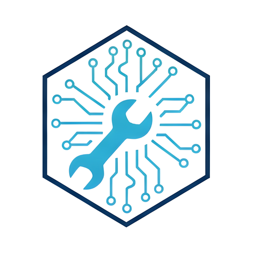

  

<h1 align="center">Soundboard</h1>

<strong>by Davis Tech Support</strong>

An offline soundboard app for phones, tablets, and computers. Install it once and use it anywhere, with no internet and no account.

---

## Overview

Soundboard turns any device into a tap-to-play sound deck. Load your own audio or video clips, or record new ones with the microphone, and each one becomes a colorful pad you can tap to play. Everything is saved on the device, so your boards are ready every time you open the app, even with no connection.

It's built as a Progressive Web App (PWA). Visit the link once, add it to your home screen, and it runs like a regular app from then on.

## Features

- **Tap-to-play pads** with a live progress ring and a playing indicator
- **Multiple boards** to keep separate sets of sounds for different events, classes, or games
- **Record from the mic** to create a pad on the spot
- **Customize each pad** with its own name, color, volume, and keyboard shortcut
- **Drag to reorder** by pressing and holding a pad
- **Stop all** button and **master volume** for the whole board
- **Lock mode** hides editing controls so pads can't be changed or deleted by accident (press and hold the lock to unlock)
- **Works offline** after the first visit
- **Private by design:** sounds stay on your device and are never uploaded
- Supports MP3, WAV, M4A, AAC, OGG, FLAC, WebM, and MP4/MOV/M4V video (audio is played)

## Install

1. Open the app link in Safari (iPhone/iPad) or Chrome (Android/computer).
2. Let the page finish loading.
3. Install it:
   - **iPhone/iPad:** tap **Share → Add to Home Screen**
   - **Android:** tap **⋮ → Install app**
   - **Computer:** click the install icon in the address bar
4. Open it from the new icon and tap **Add sound** or **Record** to build your first board.

> **Tip for iPhone:** add your sounds inside the installed app, not in a Safari tab. iOS keeps their storage separate.

## Good to know

- Each person's boards are stored only on their own device. Deleting the app or clearing browser data removes them, so keep your original sound files.
- Updates install automatically the next time the app is opened with an internet connection.

## Project files

| File | Purpose |
| --- | --- |
| `index.html` | The app |
| `sw.js` | Offline support (service worker) |
| `manifest.webmanifest` | Install settings, name, and icons |
| `icon-*.png`, `apple-touch-icon.png` | App icons |
| `logo-mark.png`, `logo-full.png` | Branding |
| `LICENSE.txt` | MIT License |
| `TRADEMARKS.md` | Rules for the Davis Tech Support name and logo |

To publish a change, update `index.html` and bump `VERSION` in `sw.js` (for example, `soundboard-v5` → `soundboard-v6`) so installed copies pick it up.

## License

Released under the [MIT License](LICENSE.txt). Copyright © 2026 Davis Tech Support (Michael Davis).

You're free to use, copy, modify, and share this project, including in commercial work, as long as the copyright and license notice stay with it.

**Name and logo:** the MIT License covers the code only. The Davis Tech Support name and logo are not licensed for reuse (see [`TRADEMARKS.md`](TRADEMARKS.md)). If you publish your own version, swap in your own name and icons and don't present it as made or endorsed by Davis Tech Support.

## Contributing

Bug reports, ideas, and pull requests are welcome. Open an issue to describe what you found or what you'd like to add.

## Contact

**Davis Tech Support**, IT consulting and managed services in Central Virginia

- Website: [davis-tech-support.com](https://davis-tech-support.com)
- Email: [davis.tech.va@gmail.com](mailto:davis.tech.va@gmail.com)
- Phone/Text: 434-294-4456

For licensing, custom versions, or support, get in touch.
